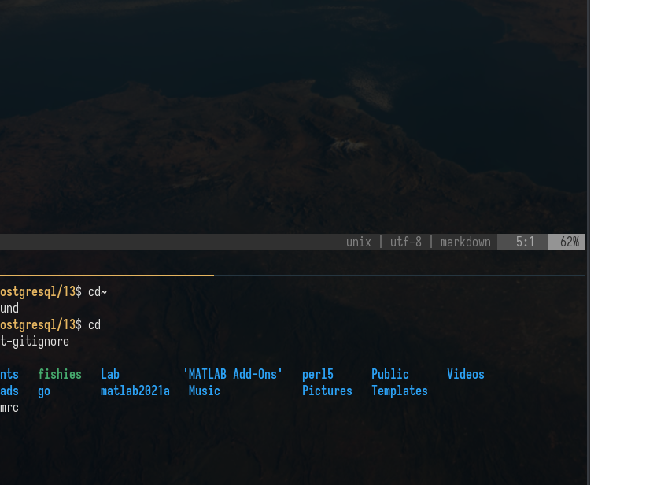
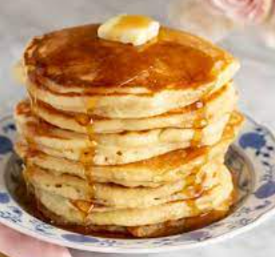

# How to take a note 

Take note :D 

## Here we look for some akjdwalkwj dlkjwa kjwalkd j

wdaw NIce text heerek jlkajdwlk jaw;ldj wa;ldj waldj waldkj ;waldj
akdjlaksjfh lakehf lkahfldk ahfl kdh
default - A number (or variable) containing the number of paragraphs or words
to generate (default is 1). method, Either w for words, p for HTML paragraphs
...

Cool huh?

## Pancake reciepe 

1 ½ cups all-purpose flour

3 ½ teaspoons baking powder

¼ teaspoon salt, or more to taste

1 tablespoon white sugar

1 ¼ cups milk

1 egg

3 tablespoons butter, melted

* [20220609143904](/20220609143904/) note number three

Tags:

    #vim #screenshot
